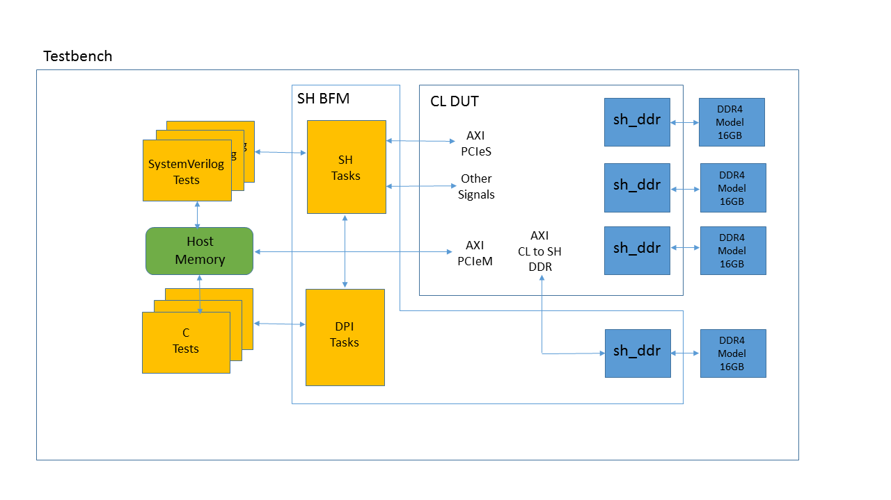
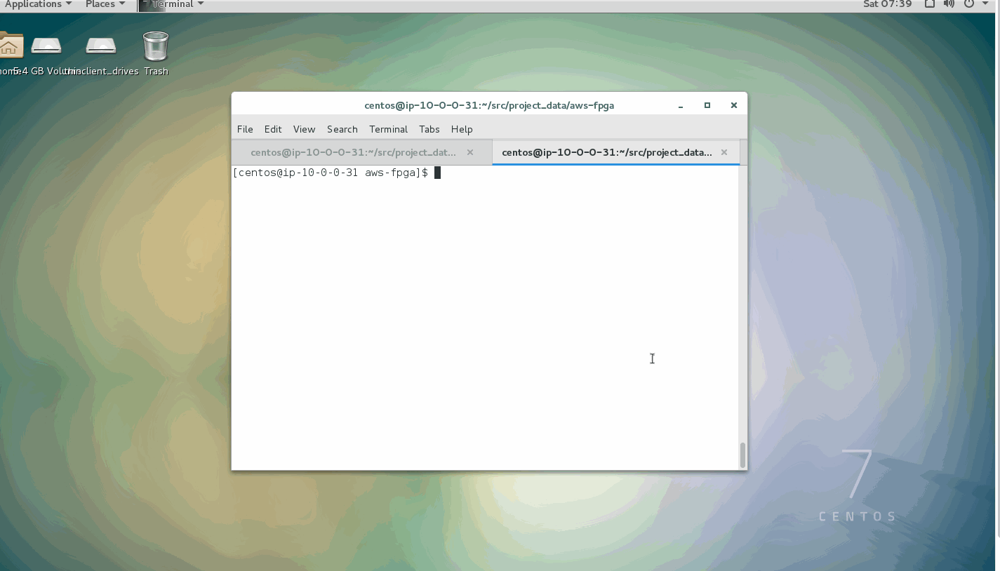
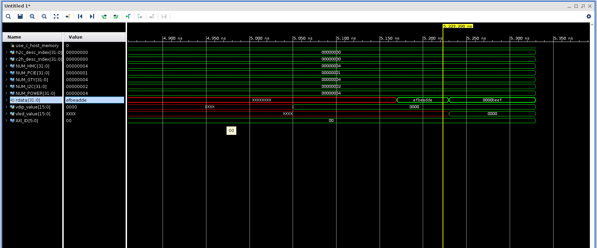
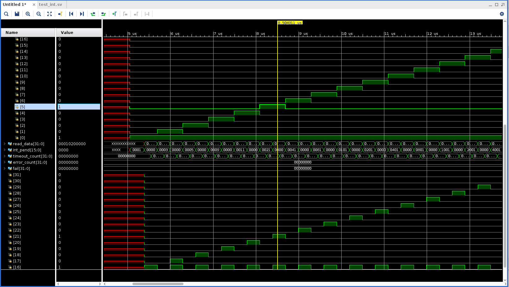
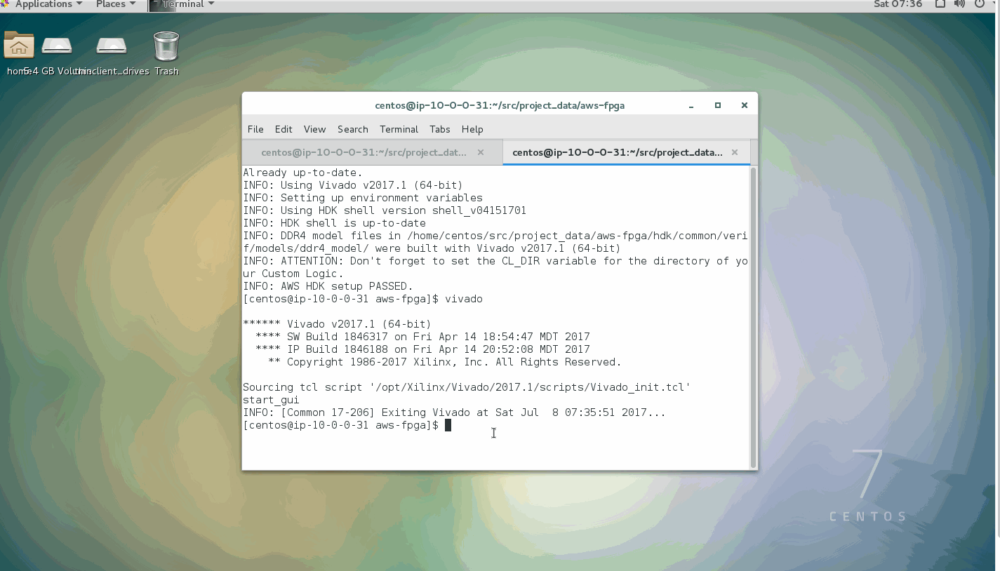
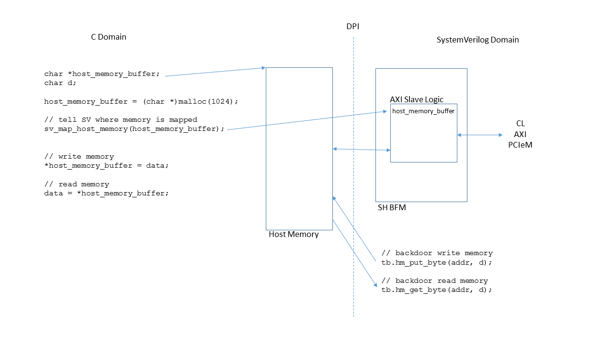

#### AWS EC2 F1について、みんなでワイワイ調べる会
#### サンプルデザインのテストベンチ&テストプログラムを開発するチーム
#### 活動報告

2017.07.08

チーム2: 橘川さん, @JAPLSDさん, @kenzonagさん, @si1242さん, @\_tkato\_

https://fpgax.connpass.com/event/52769/

---

### やったこと

* HDKのExampleのテストベンチについて
    * コードリーディング
    * F1インスタンスで動作確認し、波形を確認

RTLシミュレーションや、Exampleの動かし方などは以下を参照

[RTL Simulation for Verilog/VHDL Custom Logic Design with AWS HDK]( https://github.com/aws/aws-fpga/blob/master/hdk/docs/RTL_Simulating_CL_Designs.md)

---

### テストベンチ

<a href="./resources/Slide2.PNG">

</a>

引用：https://github.com/aws/aws-fpga/tree/master/hdk/docs/ppts/simulation

---

### 今回確認したExample

https://github.com/aws/aws-fpga/tree/master/hdk/cl/examples

* cl_hello_world
    * test_hello_null
    * test_hello_world
* cl_dram_dma
    * test_null
    * test_int
    * test_dram_dma

---

### RTLシミュレーションの実行方法

```sh
cd aws-fpga/hdk/cl/examples/cl_hello_world/verif/scripts
make TEST=test_hello_world
```

* makeを実行すると、合成、シミュレーションが行われる（CUI）
* TESTを指定しない場合、デフォルトではtest_nullが実行されるので注意
* GUIで実行する方法は後述

---

### test_hello_world.sv

[cl_hello_world/verif/tests/test_hello_world.sv](https://github.com/aws/aws-fpga/blob/master/hdk/cl/examples/cl_hello_world/verif/tests/test_hello_world.sv)

makeしてRTLシミュレーションを実行、波形を確認するまで

<a href="./resources/f1-simulation-hello-world.gif">

</a>

以降、F1インスタンスの画像は@si1242さんより引用
https://github.com/si1242/f1-instance-share

---

### test_hello_world.sv

HelloWorldレジスタを読んだ値に注目

<a href="./resources/wave_hello_world.png">

</a>

---

### test_int.sv

[cl_dram_dma/verif/tests/test_int.sv](https://github.com/aws/aws-fpga/blob/master/hdk/cl/examples/cl_dram_dma/verif/tests/test_int.sv)

割り込みレジスタの組み合わせを変えながらテストしている

<a href="./resources/wave_test_int.png">

</a>

---

### test_dram_dma.sv

[cl_dram_dma/verif/tests/test_dram_dma.sv](https://github.com/aws/aws-fpga/blob/master/hdk/cl/examples/cl_dram_dma/verif/tests/test_dram_dma.sv)

波形ではアドレスが変わるのは確認できたが、データはどの信号を確認すればよいかはわからなかった。

<a href="./resources/f1-simulation-dram_dma.gif">

</a>

---

### VivadoのGUIでRTLシミュレーションする

* デフォルトの `make` はバッチモード（CUI）
* VivadoのGUIを立ち上げるために、各Exampleのファイルを修正した
* シミュレーション終了後にプロジェクト(.xpr)を保存しておくと便利

#### verif/scripts/Makefile.vivado

```diff
 run:
-       cd $(SIM_DIR) && xsim -R -log test.log -tclbatch $(SCRIPTS_DIR)/waves.tcl tb
+       cd $(SIM_DIR) && xsim -R -log test.log -g -tclbatch $(SCRIPTS_DIR)/waves.tcl tb
```

#### verif/scripts/waves.tcl

シミュレーション後にVivadoが終了しないようにするため、"quit"を削除

```diff
 run 200 us
-quit
```

---

### VivadoのGUIでRTLシミュレーションする

波形を観るだけなら、CUIで実行した後に以下の手順でできる

[View waves in Vivado using .tcl]( https://github.com/aws/aws-fpga/blob/master/hdk/docs/RTL_Simulating_CL_Designs.md#view-waves-in-vivado-using-tcl)


---

### テストAPI

peek, pokeなど、テストベンチ用の関数の仕様

* [SV Test API Reference]( https://github.com/aws/aws-fpga/blob/master/hdk/docs/RTL_Simulating_CL_Designs.md#sv-test-api-reference)
* [C Test API Reference](https://github.com/aws/aws-fpga/blob/master/hdk/docs/RTL_Simulating_CL_Designs.md#c-test-api-reference)
* Cについては、ドライバも参照
    * [aws-fpga/sdk/userspace/include/fpga_pci.h](https://github.com/aws/aws-fpga/blob/master/sdk/userspace/include/fpga_pci.h)

---

### テストAPI

RTLシミュレーション時は、CL（カスタムロジック）のメモリをホストにマップして直接読み書きできて便利

[Accessing Host Memory During Simulation]( https://github.com/aws/aws-fpga/blob/master/hdk/docs/RTL_Simulating_CL_Designs.md#accessing-host-memory-during-simulation)

<a href="./resources/Slide3.PNG">

</a>

引用： https://github.com/aws/aws-fpga/blob/master/hdk/docs/RTL_Simulating_CL_Designs.md#accessing-host-memory-during-simulation
